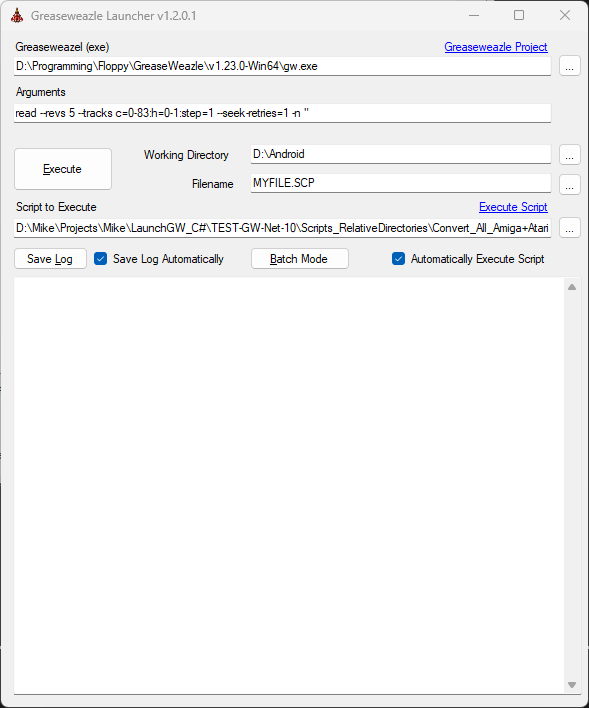

# Simple Greaseweazle Launcher in C#
A simple C# .Net 4.8 front end, for Greaseweazle, to capture a flux file, save the onscreen text to a log file and execute a script when the disk is dumped. It also has a configurable right-click menu, to store several GW configs, for ease of use. It is *very* simple, with minimal error checking.

Looks like so:

